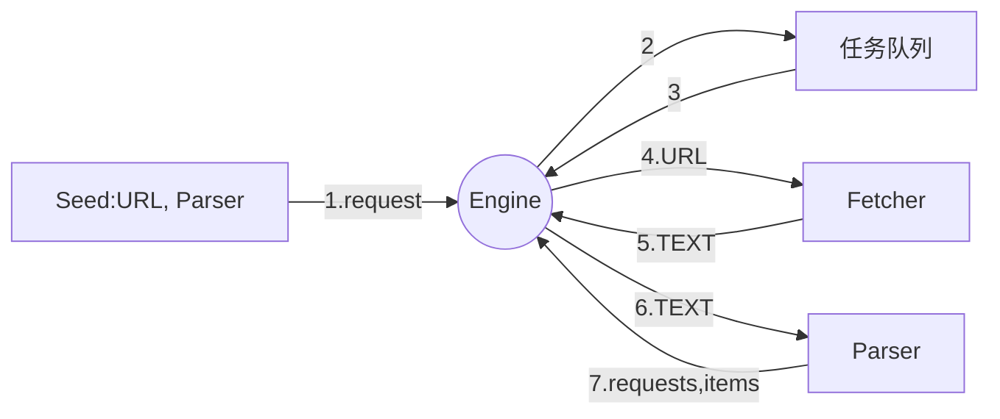

### 1. go 语言的爬虫库/框架
- henrylee2cn/pholcus
- gocrawl
- colly
- hu17889/go_spider

### 2. 将不使用现有的爬虫库/框架
### 3. 使用ElasticSearch
### 4. 使用Go语言标准模版库实现http数据展示部分=
### 5. 爬虫主题：
- 爬取内容：如 新闻
- 爬取人：如 QQ空间、人人网、微博、微信、facebook
         如 相亲网站<隐私弱>、求职网站<隐私强> (不要爬取隐私的页面)
### 6. 爬虫的法律风险
- robots 协议   https://github.com/robots.txt
    查看真爱网的robots.txt http://www.zhenai.com/robots.txt   
    https://album.zhenai.com/robots.txt
    http://www.xcar.com.cn/robots.txt
- 技术上：没有约束力
- 法律上：作为参考
    - robot说不能爬取？ 还爬， 不好
    - 爬虫的法律风险：
        1> robots协议没有禁止，可以爬吗？
            不一样
        2> robots协议默认允许所有
        3> 网站所有者可能未关注，或者写错
        4> 结果导向，
            A. 要看数据用来做什么:
                使用尝试判断 -> 隐私贩卖
                若不确定，请求相关人士，或直接联系对方
            B. QPS: 不能发送请求太多

### 7. 新的爬虫（页面结果更新）
- 爬取：比较廉价的数据，访问量大的网站 (数据不会更新， QPS大) eg: 金融、体育、新闻、产品 ...
- b. 爬取爱卡汽车各类车型的软件
- c. 项目的设计使用得我们只需要增量修改
- d. 新的解析器，新的配置
### 8. 如何发现用户 （zhenai网）
- a. 城市列表 -> 城市 -> (下一页) -> 用户
- b. 通过用户 -> 猜你喜欢
- c. 通过已有用户id+1来猜测用户id
    https://www.zhenai.com/zhenghun:
### 9. 爬虫的实现步逐：
    单任务 -> 并发版 -> 分布式
### 10. 单任务版爬虫
- a. 获取并打印所有城市第一页用户的详细信息
- b. 单任务版爬虫架构

