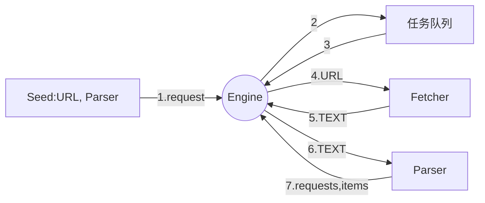

https://github.com/cockroachdb/cockroach

### 1. go 语言的爬虫库/框架
- henrylee2cn/pholcus
- gocrawl
- colly
- hu17889/go_spider

### 2. 将不使用现有的爬虫库/框架
### 3. 使用ElasticSearch
### 4. 使用Go语言标准模版库实现http数据展示部分=
### 5. 爬虫主题：
- 爬取内容：如 新闻
- 爬取人：如 QQ空间、人人网、微博、微信、facebook
         如 相亲网站<隐私弱>、求职网站<隐私强> (不要爬取隐私的页面)
### 6. 爬虫的法律风险
- robots 协议   https://github.com/robots.txt
    查看真爱网的robots.txt http://www.zhenai.com/robots.txt   
    https://album.zhenai.com/robots.txt
    http://www.xcar.com.cn/robots.txt
- 技术上：没有约束力
- 法律上：作为参考
    - robot说不能爬取？ 还爬， 不好
    - 爬虫的法律风险：
        1> robots协议没有禁止，可以爬吗？
            不一样
        2> robots协议默认允许所有
        3> 网站所有者可能未关注，或者写错
        4> 结果导向，
            A. 要看数据用来做什么:
                使用尝试判断 -> 隐私贩卖
                若不确定，请求相关人士，或直接联系对方
            B. QPS: 不能发送请求太多

### 7. 新的爬虫（页面结果更新）
- 爬取：比较廉价的数据，访问量大的网站 (数据不会更新， QPS大) eg: 金融、体育、新闻、产品 ...
- b. 爬取爱卡汽车各类车型的软件
- c. 项目的设计使用得我们只需要增量修改
- d. 新的解析器，新的配置
### 8. 如何发现用户 （zhenai网）
- a. 城市列表 -> 城市 -> (下一页) -> 用户
- b. 通过用户 -> 猜你喜欢
- c. 通过已有用户id+1来猜测用户id
    https://www.zhenai.com/zhenghun:
### 9. 爬虫的实现步逐：
    单任务 -> 并发版 -> 分布式
### 10. 单任务版爬虫
- a. 获取并打印所有城市第一页用户的详细信息
- b. 单任务版爬虫架构


### 11. ElasticSearch
#### ElasticSearch 是什么
- 全文搜索引擎
- 快速地存储、搜索和分析海量数据
- 用户：维基百科、Stackv Overflow、Github
#### ElasticSearch 能做什么
- 存储我们爬取的数据
- 不需要建表，配置字段等
- json格式的文档
- 寻找：男，有房，有车
- 寻找：女， 年轻漂亮 -> 年轻身材好 -> 年轻身材指标好
- 原生支持，不需要写代码，不需要拼装查询语句
#### ElasticSerch 的安装
- 从网站下载安装包，安装，配置，运行
- 直接使用Docker

### 12. Docker
- 容器引擎
- 打包/发布应用程序，包括系统环境，配置，依赖
- 虚拟化，沙箱机制
- 解决了“在我机器上运行的好好地”
- 使用Go语言编写！
#### Docker 的安装
- 下载安装包并且安装 http://get.daocloud.io/ or http://www.docker.com
#### Docker 的命令
- docker run -d -p 80:80 nginx
#### 使用ElasticSearch7 的Docker
- 使用bing国际搜索： docker pull elasticSearch
- docker pull docker.elastic.co/elasticsearch/elasticsearch:7.6.0
- docker run -p 9200:9200 -p 9300:9300 -e "discovery.type=single-node" docker.elastic.co/elasticsearch/elasticsearch:7.6.0

```
https://github.com/olivere/elastic

go get -u github.com/olivere/elastic/v7
```
### 13. 标准模版库介绍】
- 添加前端
### 14. 分布式系统
- 多个节点
- 消息传递
- 完成特定的需求
#### 多个节点
- 容错性: 是使系统在部分组件（一个或多个）发生故障时仍能正常运作的能力。
- 可扩展性(性能)
- 固有分步性: 业务具有固有分布性
#### 消息传递
- 节点具有私有存储性
- 易于开发
- 可扩展性(功能)
- 对比: 并行计算
#### 消息传递的方法
- REST
- RPC
- 中间件
### 一般消息传递的方法
- 对外: REST
- 模块内部: RPC (耦合度紧) 效率能快一点
- 模块之间: 中间件(耦合度松),REST
### 分布式架构 VS 微服务架构
- 分布式: 指导节点之间如何通信(数据访问层、表示层划分模块)
- 微服务: 鼓励按业务划分模块(按照业务划分)
- 微服务架构通过分布式架构来实现
### 多层架构 VS 微服务架构
- 微服务架构具有更多的"服务"
- 微服务通常需要配合自动化测试，部署，服务发现等
- 目前我们趋向于服务器架构(因为现在自动化测试、自动化部署、自动化服务都已经很成熟了)
### 并发版爬虫架构
- 看图
#### 目前的问题(单机)
- 限流问题
- 去重问题
- 数据存储问题
#### 限流问题
- 单节点能承受的流量有限
- 将Worker放到不同的节点
#### 去重问题
- 单节点能承受的去重数据量有限
- 无法保存之前去重结果
- 解决方法: 基于Key-Value Store(如Redis) 进行分布式去重
#### 存储问题(不是一个技术问题,而是一个管理问题)
- 存储部分的结构,技术栈和爬虫部分区别很大
- 进一步优化需要特殊的ElasticSearch技术背景
- 固有的分布式(人进行分工)
### 本课程架构
- 解决限流问题(理论上)
- 解决存储问题(需要独立出来单独开发)
- 分布式去重: 回家作业
### 从Channel到分布式
```
            channel
goroutine -----------> goroutine
```
#### PRC
- jsonrpn(很课程采用)
- grpc(使用protobuf)<来自Google>
- Thrift (和grpc有点像)
#### 自有协议
- docker/libchan
- NATS streaming
- gocircuit
- 根据自己需求(定义自己的协议)